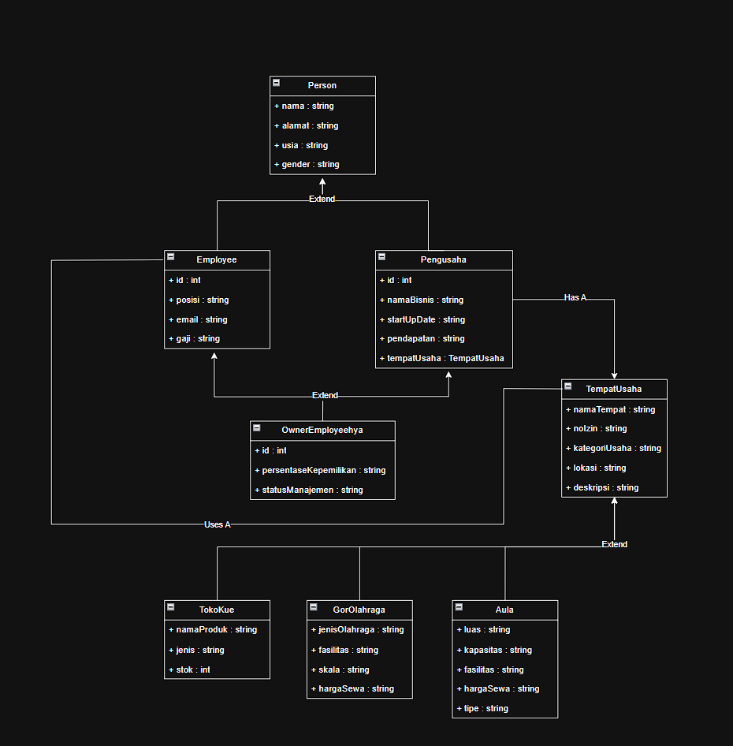

# TP3DPBO2425C2

tp yall

saya Rafi Ahmad Al Farisi dengan NIM 2409829
mengerjakan TP 3 dalam mata kuliah Design Pemrograman Berbasis Object
untuk keberkahannya maka saya tidak akan melakukan kecurangan
seperti yang telah di spesifikasikan Aamiin.

Diagram

Penjelasan Atribut dan Metode Setiap Kelas

1. Person.cpp
   Kelas dasar untuk merepresentasikan individu.
   Atribut:
   nama: Nama individu (string).
   alamat: Alamat (string).
   usia: Usia (integer).
   gender: Gender (string).

   Metode:
   Constructor: Menginisialisasi objek Person.
   Getter dan Setter: Untuk mengakses dan memodifikasi setiap atribut.
   operator=: Operator assignment untuk menyalin data dari objek Person lain.

2. TempatUsaha.cpp
   Kelas dasar untuk merepresentasikan tempat usaha.
   Atribut:
   namaTempat: Nama tempat usaha (string).
   noIzin: Nomor izin usaha (string).
   kategoriUsaha: Kategori usaha (string), contoh: "Kuliner" atau "Gedung".
   lokasi: Lokasi tempat usaha (string).
   deskripsi: Deskripsi singkat tentang usaha (string).

   Metode:
   Constructor: Menginisialisasi objek TempatUsaha.
   Getter dan Setter: Untuk mengakses dan memodifikasi setiap atribut.

3. Employee.cpp
   Kelas yang merepresentasikan seorang karyawan.
   Atribut:
   id: ID karyawan (integer).
   posisi: Jabatan atau posisi kerja (string).
   email: Email karyawan (string).
   gaji: Gaji bulanan (double).
   tempatKerja: Pointer ke objek TempatUsaha tempat karyawan bekerja. Ini adalah contoh komposisi.

   Metode:
   Constructor: Menginisialisasi objek Employee.
   hitungGajiTahunan(): Menghitung gaji tahunan dengan mengalikan gaji bulanan dengan 12.
   setTempatKerja(): Mengatur tempat kerja karyawan.
   getTempatKerja(): Mengembalikan pointer ke objek TempatUsaha.
   operator=: Operator assignment.

4. Pengusaha.cpp
   Kelas yang merepresentasikan seorang pengusaha.
   Atribut:
   id: ID pengusaha (integer).
   namaBisnis: Nama bisnis yang dijalankan (string).
   startUpDate: Tanggal pendirian bisnis (string).
   pendapatan: Pendapatan bisnis (double).

   Metode:
   Constructor: Menginisialisasi objek Pengusaha.
   hitungProfit(): Menghitung profit dengan mengalikan pendapatan dengan 0.3.
   operator=: Operator assignment.

5. OwnerEmployee.cpp
   Kelas untuk seseorang yang merupakan karyawan sekaligus pengusaha.
   Atribut:
   idOE: ID untuk OwnerEmployee (integer).
   persentaseKepemilikan: Persentase kepemilikan bisnis (string).
   statusManajemen: Status dalam manajemen, contoh: "aktif" atau "pasif" (string).

   Metode:
   Constructor: Menginisialisasi objek OwnerEmployee.
   hitungTotalKompensasi(): Menghitung total kompensasi gabungan dari gaji tahunan (sebagai karyawan) dan profit (sebagai pengusaha).
   operator=: Operator assignment.

6. Aula.cpp
   Kelas turunan dari TempatUsaha untuk jenis usaha "aula".
   Atribut Tambahan:
   luas: Luas aula (double).
   kapasitas: Kapasitas jumlah orang (string).
   fasilitas: Fasilitas yang tersedia (string).
   hargaSewa: Harga sewa (double).
   tipe: Tipe aula (string).

7. GorOlahraga.cpp
   Kelas turunan dari TempatUsaha untuk jenis usaha "gedung olahraga".
   Atribut Tambahan:
   jenisOlahraga: Jenis olahraga yang dapat dilakukan (string).
   fasilitas: Fasilitas yang tersedia (string).
   skala: Skala gedung, contoh: "nasional" atau "lokal" (string).
   hargaSewa: Harga sewa (double).

8. TokoKue.cpp
   Kelas turunan dari TempatUsaha untuk jenis usaha "toko kue".
   Atribut Tambahan:
   namaProduk: Nama produk utama (string).
   jenis: Jenis produk (string).
   stok: Stok produk (integer).

Penjelasan Desain Program
-> Inheritance (Pewarisan)
Desain program ini menggunakan konsep pewarisan untuk menciptakan hierarki kelas yang terorganisir.
-> Pewarisan Tunggal:
-> Kelas Person adalah kelas dasar (base class).
-> Kelas Employee dan Pengusaha mewarisi atribut dan metode dari Person.
-> Kelas TempatUsaha juga merupakan kelas dasar yang diwarisi oleh Aula, GorOlahraga, dan TokoKue. Ini memungkinkan setiap jenis tempat usaha memiliki atribut spesifiknya sendiri sambil tetap mempertahankan atribut dasar dari TempatUsaha.-

    -> Pewarisan Majemuk (Multiple Inheritance):

    Kelas OwnerEmployee mewarisi dari dua kelas induk, yaitu Employee dan Pengusaha. Ini memungkinkan objek OwnerEmployee memiliki karakteristik dan metode dari kedua kelas, seperti hitungGajiTahunan() dari Employee dan hitungProfit() dari Pengusaha.

    -> Pewarisan Virtual (virtual keyword):

    Kata kunci virtual digunakan pada pewarisan Person oleh Employee dan Pengusaha. Ini untuk mengatasi masalah yang dikenal sebagai "Diamond Problem". Tanpa virtual, kelas OwnerEmployee akan mewarisi dua salinan dari Person (satu dari Employee, satu dari Pengusaha), yang dapat menyebabkan ambiguitas. Dengan virtual, hanya satu salinan Person yang akan diwarisi, sehingga masalah teratasi.

    -> Composition (Komposisi)
        Selain pewarisan, program ini juga menggunakan konsep komposisi.

        Relasi Employee dan TempatUsaha : Kelas Employee memiliki atribut tempatKerja berupa pointer ke objek TempatUsaha. Ini menunjukkan relasi "memiliki" (has-a), di mana setiap karyawan (Employee) memiliki tempat kerja (TempatUsaha).

        Relasi Pengusaha dan TempatUsaha : kelas Pengusaha  memiliki atribut tempatUsahaDimiliki. Ini secara eksplisit menunjukkan bahwa seorang pengusaha "memiliki" tempat usaha.

Penjelasan Alur Program
Program utama (Main) berfungsi sebagai antarmuka yang memungkinkan pengguna untuk mengelola data.

    Struktur Data: Data disimpan dalam vector dari pointer untuk setiap kelas (TempatUsaha, Employee, Pengusaha, dan OwnerEmployee).

    Menu Interaktif: Pengguna dapat memilih opsi dari menu untuk menambah data, melihat tabel data, atau keluar dari program.

    Fungsi Input: Fungsi-fungsi input (inputTempatUsaha, inputEmployee, inputPengusaha, inputOwnerEmployee) akan memandu pengguna untuk memasukkan data yang relevan.

    Keterhubungan Data: Saat menambah Employee atau Pengusaha baru, program memungkinkan pengguna untuk memilih dan menghubungkan objek tersebut dengan TempatUsaha yang sudah ada, memperkuat relasi komposisi.

    Fungsi Cetak: Fungsi cetak tabel akan menampilkan data dengan format yang rapi dan mudah dibaca, termasuk detail tempat kerja atau tempat usaha yang dimiliki.

    Manajemen Memori: Di akhir program, semua objek yang dialokasikan secara dinamis menggunakan new akan dihapus menggunakan delete untuk mencegah kebocoran memori.

Dokumentasi

CPP

PYTHON

JAVA

